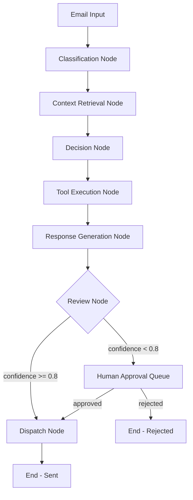

# Agent Workflow Specification

## Overview

The ReasonFlow agent is a LangGraph `StateGraph` that processes emails through a deterministic node sequence with conditional branching for human review.

## Workflow Graph



## Agent State Schema

```python
class AgentState(TypedDict):
    email: dict              # {id, subject, body, sender, received_at}
    classification: str      # Intent category
    confidence: float        # Classification confidence (0-1)
    context: list[str]       # Retrieved context strings
    selected_tools: list[str]# Tools chosen by decision node
    tool_results: dict       # {tool_name: result}
    draft_response: str      # Generated response text
    requires_approval: bool  # Whether human review is needed
    final_response: str      # Approved response to send
    error: str | None        # Error message if any step failed
    steps: list[dict]        # Execution trace log
```

## Node Specifications

### 1. Classification Node
- **Input**: `email`
- **Output**: `classification`, `confidence`
- **LLM Call**: `GeminiClient.classify_intent(subject, body, sender)`
- **Categories**: inquiry, meeting_request, complaint, follow_up, spam, other
- **Short-circuit**: If `spam` with high confidence → skip remaining nodes

### 2. Context Retrieval Node
- **Input**: `email`, `classification`
- **Output**: `context`
- **Actions**:
  - Embed the email text
  - Search pgvector for similar past emails
  - Fetch CRM contact data if available
  - Fetch recent calendar events if meeting-related
- **Dependencies**: Retrieval module, CRM client, Calendar client

### 3. Decision Node
- **Input**: `classification`, `email`, `context`
- **Output**: `selected_tools`
- **LLM Call**: `GeminiClient.decide_tools(classification, subject, body, context)`
- **Tool Selection Rules**:
  - meeting_request → [check_calendar, create_draft]
  - complaint → [get_contact, create_draft] (never auto-send)
  - inquiry → [get_contact?, create_draft]
  - follow_up → [get_contact, create_draft]
  - spam → [] (no tools)

### 4. Tool Execution Node
- **Input**: `selected_tools`, `email`
- **Output**: `tool_results`
- **Actions**: Iterates selected tools, calls each via ToolManager
- **Logging**: Each tool call → ToolExecution record
- **Error Handling**: Individual tool failures don't stop other tools

### 5. Response Generation Node
- **Input**: `email`, `classification`, `context`, `tool_results`
- **Output**: `draft_response`
- **LLM Call**: `GeminiClient.generate_response(...)`
- **Tone Matching**: Professional for inquiries, empathetic for complaints, friendly for follow-ups

### 6. Review Node
- **Input**: `draft_response`, `confidence`
- **Output**: `requires_approval`, `final_response`
- **Logic**:
  - If `confidence >= 0.8` → auto-approve, set `final_response = draft_response`
  - If `confidence < 0.8` → set `requires_approval = True`, await human
  - If classification is `complaint` → always require approval

### 7. Dispatch Node
- **Input**: `final_response`, `email`
- **Output**: Send email via Gmail API
- **Actions**: Call `GmailClient.send_email()` or `create_draft()`
- **Logging**: Final status update on Email record

## State Transitions

| From | To | Condition |
|------|----|-----------|
| START | classify | Always |
| classify | retrieve | classification != spam |
| classify | END | classification == spam (high conf) |
| retrieve | decide | Always |
| decide | execute_tools | selected_tools is not empty |
| decide | generate | selected_tools is empty |
| execute_tools | generate | Always |
| generate | review | Always |
| review | dispatch | confidence >= 0.8 AND not complaint |
| review | HUMAN_QUEUE | confidence < 0.8 OR complaint |
| dispatch | END | Always |

## Error Handling

- Each node wraps execution in try/except
- Errors are recorded in `AgentLog.error_message`
- Retry policy: 3 attempts with exponential backoff (via tenacity)
- If a node fails after retries, the email status is set to `needs_review`

## Observability

Every node execution creates an `AgentLog` entry with:
- `trace_id` — groups all steps for one email processing run
- `step_name` — node identifier
- `step_order` — sequential position
- `input_state` / `output_state` — full state snapshots
- `latency_ms` — execution time
