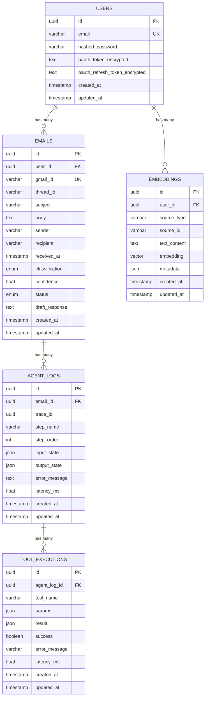

# Database Schema

## Entity Relationship Diagram

## Table Details

### users
Primary user table storing accounts and OAuth credentials.

| Column | Type | Constraints | Description |
|--------|------|------------|-------------|
| id | UUID | PK | Unique user identifier |
| email | VARCHAR(320) | UNIQUE, INDEX | User email address |
| hashed_password | VARCHAR(256) | NOT NULL | bcrypt-hashed password |
| oauth_token_encrypted | TEXT | NULLABLE | Encrypted Gmail OAuth access token |
| oauth_refresh_token_encrypted | TEXT | NULLABLE | Encrypted Gmail OAuth refresh token |
| created_at | TIMESTAMPTZ | DEFAULT now() | Record creation time |
| updated_at | TIMESTAMPTZ | DEFAULT now() | Last update time |

### emails
Emails fetched from Gmail, tracked through the agent pipeline.

| Column | Type | Constraints | Description |
|--------|------|------------|-------------|
| id | UUID | PK | Unique email identifier |
| user_id | UUID | FK→users, INDEX | Owning user |
| gmail_id | VARCHAR(255) | UNIQUE | Gmail message ID |
| thread_id | VARCHAR(255) | NULLABLE | Gmail thread ID |
| subject | VARCHAR(998) | NOT NULL | Email subject |
| body | TEXT | NOT NULL | Email body content |
| sender | VARCHAR(320) | NOT NULL | Sender email address |
| recipient | VARCHAR(320) | NULLABLE | Recipient email address |
| received_at | TIMESTAMPTZ | NOT NULL | When email was received |
| classification | ENUM | NULLABLE | Agent-assigned classification |
| confidence | FLOAT | NULLABLE | Classification confidence (0-1) |
| status | ENUM | DEFAULT 'pending' | Processing pipeline status |
| draft_response | TEXT | NULLABLE | AI-generated draft response |

**Classification Enum**: `inquiry`, `meeting_request`, `complaint`, `follow_up`, `spam`, `other`

**Status Enum**: `pending`, `processing`, `drafted`, `needs_review`, `approved`, `sent`, `rejected`

### agent_logs
Step-by-step trace of each agent workflow execution.

| Column | Type | Constraints | Description |
|--------|------|------------|-------------|
| id | UUID | PK | Log entry identifier |
| email_id | UUID | FK→emails, INDEX | Processed email |
| trace_id | UUID | INDEX | Groups all steps in one run |
| step_name | VARCHAR(100) | NOT NULL | Node name (classify, retrieve, etc.) |
| step_order | INT | DEFAULT 0 | Execution order within trace |
| input_state | JSON | NULLABLE | State entering this node |
| output_state | JSON | NULLABLE | State exiting this node |
| error_message | TEXT | NULLABLE | Error if step failed |
| latency_ms | FLOAT | DEFAULT 0 | Step execution time |

### tool_executions
Individual tool calls made during agent execution.

| Column | Type | Constraints | Description |
|--------|------|------------|-------------|
| id | UUID | PK | Execution identifier |
| agent_log_id | UUID | FK→agent_logs, INDEX | Parent agent step |
| tool_name | VARCHAR(100) | NOT NULL | Tool that was invoked |
| params | JSON | NULLABLE | Input parameters |
| result | JSON | NULLABLE | Tool output |
| success | BOOLEAN | DEFAULT true | Whether execution succeeded |
| error_message | VARCHAR(500) | NULLABLE | Error if failed |
| latency_ms | FLOAT | DEFAULT 0 | Tool execution time |

### embeddings
Vector embeddings for similarity search (pgvector).

| Column | Type | Constraints | Description |
|--------|------|------------|-------------|
| id | UUID | PK | Embedding identifier |
| user_id | UUID | FK→users, INDEX | Owning user |
| source_type | VARCHAR(50) | NOT NULL | Source: email, crm, calendar |
| source_id | VARCHAR(255) | NOT NULL | ID within source system |
| text_content | TEXT | NOT NULL | Original text that was embedded |
| embedding | VECTOR(768) | NULLABLE | 768-dim vector from Gemini |
| metadata | JSON | NULLABLE | Additional context |

## Indexes

- `ix_emails_user_id` — Fast lookup of user's emails
- `ix_agent_logs_email_id` — Fast lookup of logs per email
- `ix_agent_logs_trace_id` — Group all steps in a trace
- `ix_tool_executions_agent_log_id` — Tool calls per step
- `ix_embeddings_user_id` — User's embeddings
- `ix_embeddings_source` — Composite on (source_type, source_id)
- IVFFlat index on embedding vector column (when pgvector is available)
